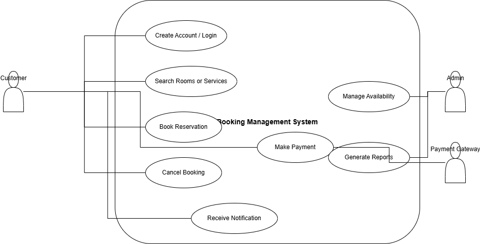

# Requirement Analysis in Software Development

## Introduction
This repository serves as a foundational resource for understanding and documenting the process of **requirement analysis** in software development.  

It explores the steps, techniques, and tools used to gather, analyze, and manage software requirements effectively. The goal is to ensure that the final software product aligns with user needs and business objectives.

Future sections of this repository will include:
- Types of requirements (functional and non-functional)
- Techniques for requirement elicitation
- Documentation templates
- Real-world case studies
## What is Requirement Analysis?

Requirement Analysis is a crucial phase in the **Software Development Life Cycle (SDLC)** where the needs and expectations of stakeholders are gathered, studied, and clearly defined. It involves identifying what a software system should do and the conditions under which it must operate.

During this phase, software engineers, business analysts, and stakeholders collaborate to understand the **functional** and **non-functional requirements** of the system. The output of this stage forms the foundation for design, development, and testing.

### Key Objectives of Requirement Analysis:
1. **Understand the Problem:** Identify the business needs or problems the software aims to solve.  
2. **Gather Requirements:** Collect detailed information from users, clients, and other stakeholders.  
3. **Analyze and Refine Requirements:** Ensure all requirements are clear, consistent, and feasible.  
4. **Document Requirements:** Create clear and structured documentation (e.g., Software Requirement Specification - SRS).  
5. **Validate Requirements:** Confirm that the documented requirements accurately reflect the stakeholder needs.

### Importance in the SDLC:
- **Prevents Miscommunication:** Ensures all stakeholders share a common understanding of the system goals.  
- **Reduces Development Costs:** Detecting and correcting requirement errors early is far cheaper than fixing them later in development.  
- **Improves Quality:** A well-analyzed requirement base leads to a more reliable and user-friendly system.  
- **Supports Project Planning:** Provides a clear scope, timeline, and resource estimate for the project.  

In summary, **Requirement Analysis** is the blueprint for software development — it bridges the gap between stakeholder expectations and technical implementation, ensuring that the final product meets its intended purpose effectively.
## Why is Requirement Analysis Important?

Requirement Analysis plays a vital role in the **Software Development Life Cycle (SDLC)** because it lays the groundwork for all subsequent stages — from design to deployment. Without proper analysis, software projects often face issues like scope creep, budget overruns, and user dissatisfaction.

Here are some key reasons why Requirement Analysis is critical:

### 1. Ensures Clear Understanding of Project Goals
Requirement Analysis helps all stakeholders — developers, clients, and users — develop a shared understanding of what the software should achieve. This clarity reduces ambiguity and sets a clear direction for development.

### 2. Minimizes Project Risks and Costs
Identifying and resolving requirement issues early in the process prevents costly rework during later stages of development. Early clarification of requirements saves both time and resources, reducing the chances of project failure.

### 3. Improves Software Quality and User Satisfaction
By accurately capturing user needs, Requirement Analysis ensures the final product aligns with user expectations and business objectives. This leads to higher user satisfaction and a more reliable, effective software solution.

### 4. Provides a Strong Foundation for Design and Testing
A well-defined set of requirements serves as a roadmap for system design and a benchmark for testing. It ensures that developers build the right features and testers validate the correct functionalities.

In essence, **Requirement Analysis is the backbone of successful software development** — it ensures that every team member knows what to build, why it’s needed, and how success will be measured.

## Key Activities in Requirement Analysis

Requirement Analysis involves a series of structured activities aimed at understanding what a system must accomplish and ensuring those needs are well-documented and validated. The following are the five key activities carried out during this phase:

- ### **1. Requirement Gathering**
  This is the initial step where information is collected from stakeholders, users, and clients to understand their expectations and business needs.  
  **Purpose:** To obtain all possible inputs related to system goals, features, and constraints.  
  **Techniques:** Interviews, questionnaires, brainstorming sessions, observation, and document analysis.

- ### **2. Requirement Elicitation**
  This activity focuses on uncovering the actual needs of stakeholders — even those they may not explicitly state.  
  **Purpose:** To identify hidden or implicit requirements and ensure no critical aspect is overlooked.  
  **Techniques:** Workshops, focus groups, prototyping, and use-case analysis.

- ### **3. Requirement Documentation**
  All gathered and elicited requirements are documented in a structured format, typically within a **Software Requirement Specification (SRS)** document.  
  **Purpose:** To provide a clear and formal reference for designers, developers, and testers throughout the project lifecycle.  
  **Outcome:** A comprehensive and well-organized requirement document approved by all stakeholders.

- ### **4. Requirement Analysis and Modeling**
  This involves evaluating, refining, and organizing the documented requirements to ensure they are clear, consistent, complete, and feasible.  
  **Purpose:** To transform raw requirements into structured models (like data flow diagrams or UML diagrams) for better understanding.  
  **Focus:** Identifying dependencies, prioritizing features, and resolving conflicts between requirements.

- ### **5. Requirement Validation**
  Validation ensures that the documented requirements accurately reflect user needs and align with business objectives.  
  **Purpose:** To confirm that requirements are correct, testable, and implementable within project constraints.  
  **Techniques:** Reviews, walkthroughs, inspections, and prototype evaluations.

In summary, these activities collectively ensure that the software development process begins with a clear, validated, and actionable understanding of what the end product should achieve.

## Types of Requirements

In software development, requirements are generally classified into two main categories — **Functional Requirements** and **Non-functional Requirements**.  
Both types are essential to ensure that the system performs as expected and delivers a great user experience.

---

### **1. Functional Requirements**

**Definition:**  
Functional Requirements describe **what the system should do** — the specific behaviors, features, and functions it must perform to meet user needs. They define the interactions between the system and its users or other systems.

**Examples (for the Booking Management System):**
- Users should be able to **create an account** and log in securely.
- The system should allow users to **search for available rooms or services** by date, type, or location.
- Users should be able to **book, modify, or cancel reservations** online.
- The system should **send email or SMS notifications** after successful booking or cancellation.
- Administrators should be able to **view all bookings**, update availability, and generate reports.
- Payment gateways should **process online payments** securely and confirm successful transactions.

**Purpose:**  
To ensure that every user action and system response needed to achieve the project’s goals is clearly defined and implemented.

---

### **2. Non-functional Requirements**

**Definition:**  
Non-functional Requirements specify **how the system should perform** rather than what it does. They define quality attributes such as performance, usability, security, and reliability that make the system efficient and user-friendly.

**Examples (for the Booking Management System):**
- The system should **load search results within 3 seconds**.
- The platform must be **available 99.9% of the time** to ensure continuous service.
- All user data should be **encrypted using SSL/TLS protocols** for secure transactions.
- The system should support **at least 1,000 concurrent users** without performance degradation.
- The user interface must be **responsive and mobile-friendly**, working seamlessly across devices.
- The system should include **role-based access control** to restrict unauthorized operations.

**Purpose:**  
To define the system’s operational qualities and ensure that it provides a reliable, secure, and satisfying experience for users.

---

In summary, **Functional Requirements** define the system’s **capabilities**, while **Non-functional Requirements** define the system’s **qualities**.  
Both are essential for delivering a well-rounded and successful Booking Management System.

## Use Case Diagrams

A **Use Case Diagram** is a visual representation of how users (actors) interact with a system. It illustrates the system’s main functionalities and the relationships between users and various use cases (actions or services the system provides).

### **Benefits of Use Case Diagrams**
- **Clarifies System Scope:** Shows what the system will do and what it won’t.  
- **Enhances Communication:** Provides a simple way for stakeholders and developers to understand requirements visually.  
- **Aids Design & Testing:** Helps identify features, interactions, and test scenarios early in development.  
- **Prevents Misunderstanding:** Reduces ambiguity in functional requirements by presenting them visually.

---

### **Use Case Diagram for the Booking Management System**

Below is a sample use case diagram showing the relationship between system actors and their interactions.

#### **Actors:**
- **Customer:** Makes bookings, cancels reservations, and views confirmations.  
- **Admin:** Manages bookings, updates availability, and generates reports.  
- **Payment Gateway:** Handles payment transactions securely.

#### **Use Cases:**
- Create Account / Login  
- Search for Rooms or Services  
- Book Reservation  
- Cancel Booking  
- Make Payment  
- Receive Notification  
- Manage Availability  
- Generate Reports

---

### **Diagram:**

*Figure: Use Case Diagram for the Booking Management System*

## Acceptance Criteria

### What is Acceptance Criteria?
Acceptance Criteria are the specific conditions that a software product must satisfy to be accepted by the client, user, or stakeholders. They define what needs to be true for a feature or user story to be considered complete and functioning as expected. 

### Importance of Acceptance Criteria in Requirement Analysis
Acceptance Criteria are important because they:
- **Ensure clarity:** They clearly describe the expected behavior of the system, reducing ambiguity between clients, developers, and testers.  
- **Serve as a validation tool:** They help determine whether the developed software meets the user requirements.  
- **Guide development and testing:** They act as a checklist for developers to build against and for testers to verify functionality.  
- **Prevent scope creep:** By clearly outlining the "done" conditions, they help control changes and expectations during the project lifecycle.  

### Example: Acceptance Criteria for the Checkout Feature in the Booking Management System
**Feature:** Checkout process for booking payments

**Acceptance Criteria:**
1. The system should allow users to review their booking summary before confirming payment.  
2. The system must support multiple payment methods (e.g., credit/debit card, bank transfer, mobile wallet).  
3. Upon successful payment, the system should display a confirmation message and send an email receipt to the user.  
4. If payment fails, the system should display an appropriate error message and allow the user to retry.  
5. The system should securely store and process payment data following industry security standards (e.g., SSL encryption).  
6. The system must update the booking status to “Confirmed” once payment is successful.  

---

By setting these criteria, both the client and development team have a shared understanding of when the “Checkout” feature is complete and ready for release.

